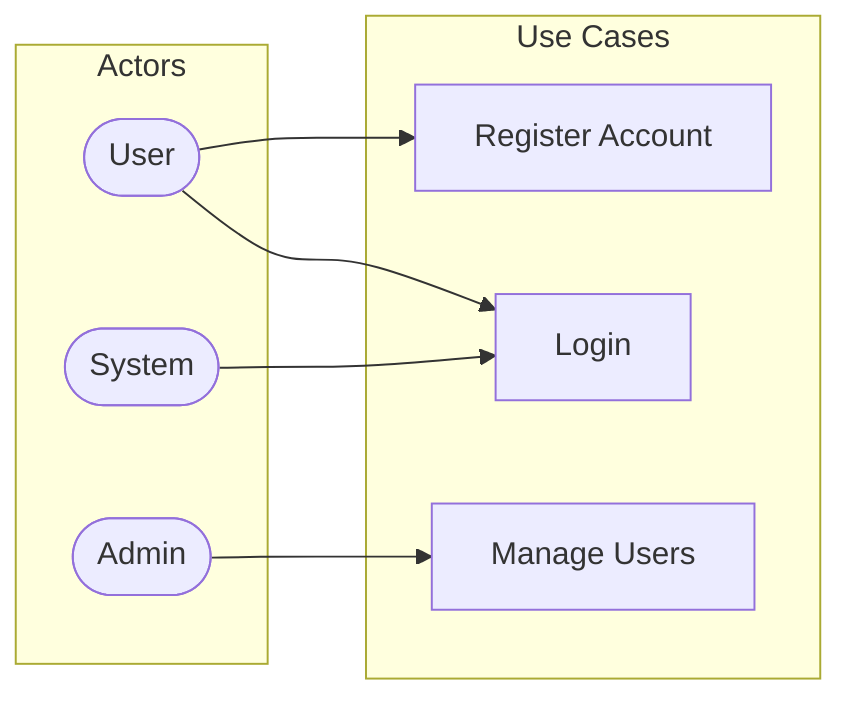
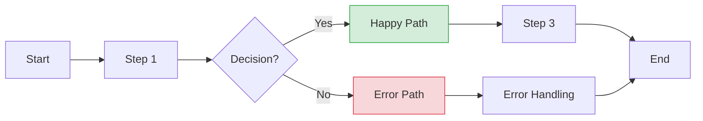

# Phase 2: Design (Detailed Guide)

## Purpose

Validate the approach visually before writing any code. Create Use Case and Process Flow diagrams to catch design flaws early.

## Required Diagrams

### 1. Use Case Diagram

Shows WHO interacts with the system and WHAT they do.

**When to create:** Always — even simple features have actors and actions.

**Structure:**



**Key elements:**
- Actors (who initiates the action)
- Use cases (what actions are performed)
- Relationships (who does what)

### 2. Process Flow Diagram

Shows HOW the system processes requests step by step.

**When to create:** Always — this is the blueprint for implementation.

**Structure:**



**Key elements:**
- Process steps (rectangles)
- Decision points (diamonds) with color-coded outcomes
- Error handling paths
- Start and end points

## Process

### Step 1: Create Use Case Diagram

Use the `figjam-diagram` skill to create the Use Case diagram:

1. Identify all actors from Phase 1 requirements
2. List all use cases (actions/features)
3. Map relationships
4. Follow the 7-step consultation process of `figjam-diagram` skill
5. Save to `docs/diagrams/mermaid/{date}-flowchart-{feature}-use-case.mmd`

### Step 2: Create Process Flow Diagram

Use the `figjam-diagram` skill to create the Process Flow diagram:

1. Map the happy path from Phase 1 acceptance criteria
2. Add decision points where logic branches
3. Add error handling paths
4. Color-code outcomes (green = positive, red = negative)
5. Follow the 7-step consultation process of `figjam-diagram` skill
6. Save to `docs/diagrams/mermaid/{date}-flowchart-{feature}-process-flow.mmd`

### Step 3: Document Design Summary

Create `docs/workflow/{feature-name}/02-design.md`:

```markdown
---
feature: {feature-name}
phase: 2-design
created: {YYYY-MM-DD}
status: draft
---

# Design: {Feature Name}

## Use Case Diagram
- Mermaid: `docs/diagrams/mermaid/{filename}.mmd`
- FigJam: [{link text}]({figjam_url})

### Actors
| Actor | Role |
| ----- | ---- |
| {actor} | {description} |

### Use Cases
| Use Case | Actor | Description |
| -------- | ----- | ----------- |
| {UC-1} | {actor} | {description} |

## Process Flow Diagram
- Mermaid: `docs/diagrams/mermaid/{filename}.mmd`
- FigJam: [{link text}]({figjam_url})

### Flow Summary
1. {Step 1}
2. {Step 2} → Decision: {condition}
   - Yes: {happy path}
   - No: {error path}

## Design Decisions
| Decision | Rationale |
| -------- | --------- |
| {decision} | {why} |

## Technical Notes
- {Implementation notes}
```

### Step 4: Get Confirmation

```markdown
Here are the design diagrams:

**Use Case Diagram:** [View in FigJam]({url})
**Process Flow Diagram:** [View in FigJam]({url})

Before we analyze edge cases:
1. Do the diagrams capture all interactions correctly?
2. Are there missing actors or use cases?
3. Is the process flow accurate?
4. Any paths or decisions missing?
```

## Confirmation Gate

**DO NOT proceed to Phase 3 until the user confirms both diagrams are correct.**

## Tips

- Keep diagrams simple — if it's too complex, break the feature into smaller tasks
- Use color-coded decision nodes for clarity
- Every decision point in the process flow becomes a potential edge case in Phase 3
- The process flow diagram becomes the implementation roadmap in Phase 4
