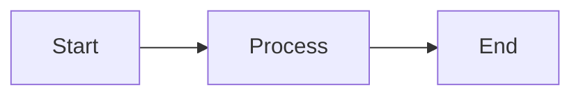
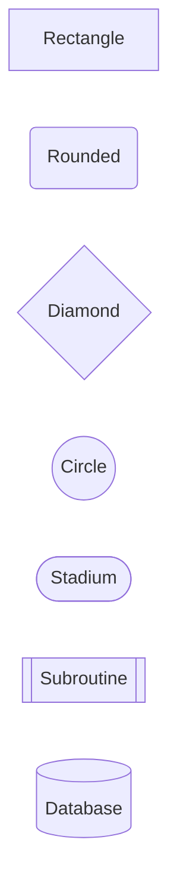
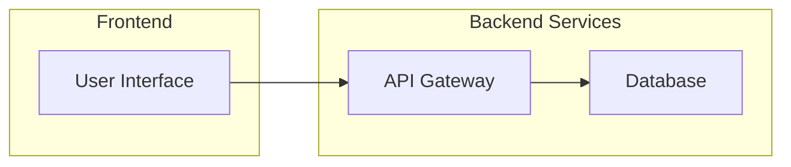
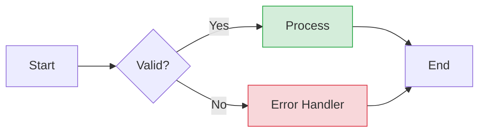
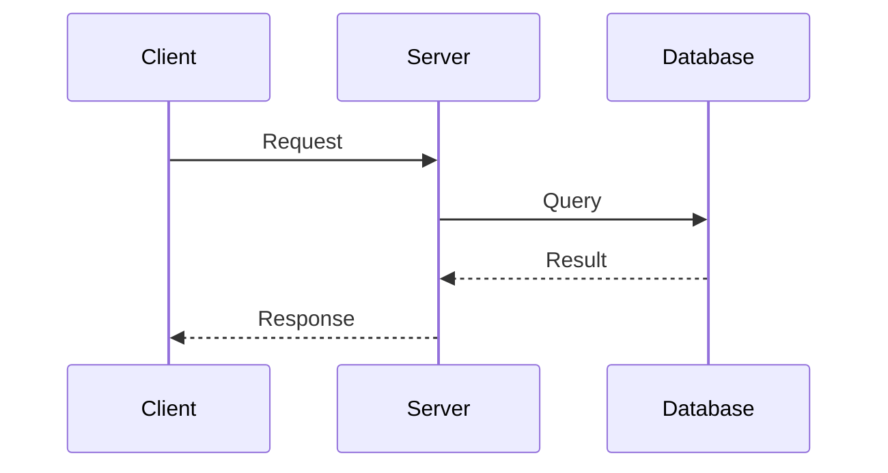
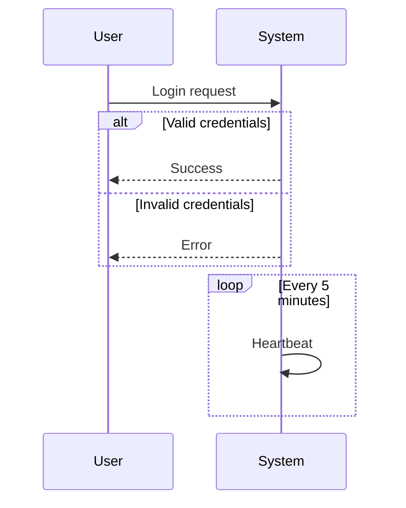
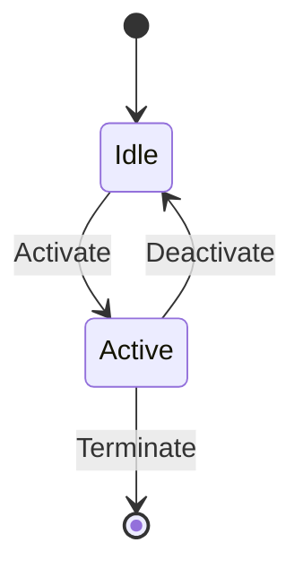
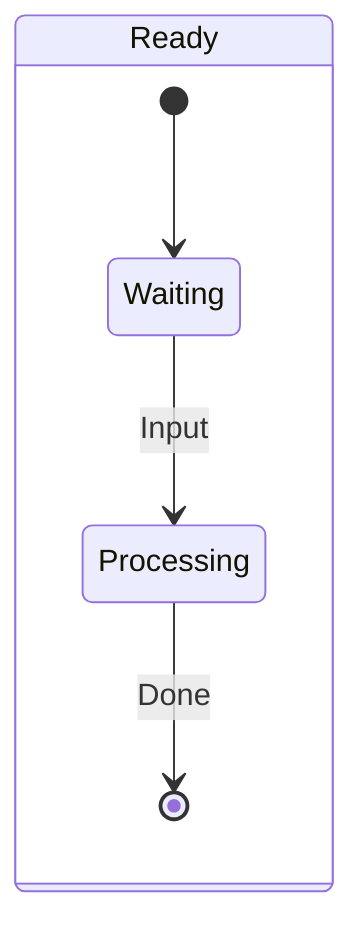
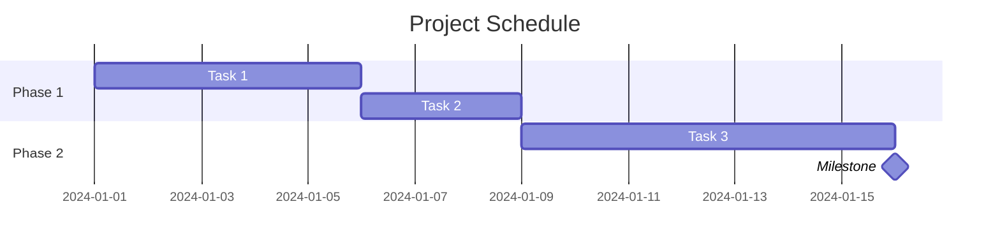

# Mermaid Syntax Guide

Mermaid.js syntax rules specifically for Figma MCP's `generate_diagram` tool.

## Critical Rules for Figma MCP

These rules are REQUIRED for the diagram to render correctly:

### 1. Text Must Be in Quotes

```mermaid
# CORRECT
A["Process Step"]
B["Decision Point"]
A -->|"Yes"| B

# WRONG
A[Process Step]
B[Decision Point]
A -->|Yes| B
```

### 2. No Spaces in Node IDs

```mermaid
# CORRECT
UserService["User Service"]
processData["Process Data"]

# WRONG
User Service["User Service"]
process data["Process Data"]
```

### 3. No Emoji Characters

```mermaid
# CORRECT
A["Start Process"]
B["Success"]

# WRONG
A["Start Process"]
B["Success"]
```

### 4. No Newline Characters in Syntax

Use actual newlines in code, not escaped `\n`.

### 5. Default Direction is LR

For flowcharts and graphs, use `LR` (Left to Right) by default:



### 6. No "end" in Class Names

```mermaid
# CORRECT
classDef processEnd fill:#f00

# WRONG
classDef end fill:#f00
```

## Flowchart Syntax

### Basic Elements



### Connection Types

| Syntax | Description |
| ------ | ----------- |
| `-->` | Arrow |
| `---` | Line |
| `-.->` | Dotted arrow |
| `==>` | Thick arrow |
| `-->|"text"|` | Arrow with text |

### Subgraphs



### Decision Node Styling (RECOMMENDED for flowcharts with if-branches)

| Outcome | Color (fill) | classDef name |
| ------- | ------------ | -------------- |
| **Positive** | Green (`#d4edda`) | `positiveClass` |
| **Negative** | Red (`#f8d7da`) | `negativeClass` |
| **Default** | No class | -- |

**Example**:



## Sequence Diagram Syntax

### Basic Elements



### Message Types

| Syntax | Description |
| ------ | ----------- |
| `->>` | Solid line, solid arrow |
| `-->>` | Dotted line, solid arrow |
| `-x` | Solid line, cross end |
| `--x` | Dotted line, cross end |

### Control Flow



**Important**: Do NOT use `note` syntax -- not supported.

## State Diagram Syntax

### Basic Structure



### Composite States



## Gantt Chart Syntax

### Basic Structure



**Note**: Do NOT use color styling in Gantt charts.

## Common Errors and Solutions

| Error | Cause | Solution |
| ----- | ----- | -------- |
| Syntax error | Spaces in node ID | Use camelCase or underscores |
| Render failure | Emoji in text | Remove all emoji |
| Missing text | Unquoted labels | Wrap all text in quotes |
| Invalid diagram | Unsupported type | Use supported types only |
